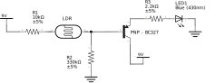
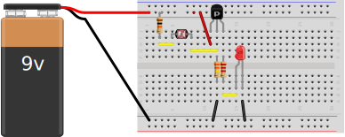

Currículos LCD - Eletrónica

# Eletrónica - Unidade 3

Vamos conhecer os Diagramas de Circuito, as placas perfuradas e aprender a soldar.

Não te queimes!

| Video | Canal | Duração
|-------|-------| --:
|[Collin's Lab: Schematics](https://www.youtube.com/watch?v=9cps7Q_IrX0) |[Make](https://www.youtube.com/channel/UChtY6O8Ahw2cz05PS2GhUbg) | 6:10
|[How to Read a Schematic](https://www.youtube.com/watch?v=_HZ-EQ8Hc8E) | [RimstarOrg](https://www.youtube.com/channel/UCSY6p1ZwMs0lW2XP7Zc7k9g) | 4:52
|[Collin's Lab: Soldering](https://www.youtube.com/watch?v=QKbJxytERvg)| [Adafruit Industries](https://www.youtube.com/channel/UCpOlOeQjj7EsVnDh3zuCgsA)| 5:08
|[Circuit Skills: Perfboard Prototyping](https://www.youtube.com/watch?v=3N3ApzmyjzE) |[Make](https://www.youtube.com/channel/UChtY6O8Ahw2cz05PS2GhUbg)| 8:36

## Projeto

### Material

Para este projeto vamos necessitar do seguinte material:

* Breadboard
* Placa perfurada para soldar
* LDR - Um foto resistor (Light Defined Resistor)
* LED 5mm
* Transistor PNP (BC327)
* Resistência 10k (R1)
* Resistẽncia 330K (R2)
* Resistência 2.2k (R3)
* Terminal de bloco com parafuro
* Pilha 9v
* Snap connector para pilha de 9v

E as seguintes ferramentas e material de proteção.

* Ferro de soldar
* Suporte para ferro de soldar
* Malha de aço para limpar ferro
* Solda
* Bomba de desoldar
* Óculos de proteção
* Superfície descartável

## Breadboard

Monta o circuito do diagrama abaixo numa breadboard para o testares.

---

A breadboard poderá ficar com a seguinte configuração:

## Placa perfurada

Faz o planeamento do posicionamento dos componentes e suas ligações usando papel e caneta.

Depois executa o teu plano e solda os componentes.

Boa sorte!!

**Não te queimes!!**

---

## Inquérito

Por favor responde ao inquérito abaixo para melhorarmos este curriculo.

* https://goo.gl/forms/bTMEV41sWgrV9OI23

## Bonos

* [Soldering is Easy (comic book)](https://mightyohm.com/files/soldercomic/FullSolderComic_EN.pdf)
* [Circuit Symbols](https://electronicsclub.info/circuitsymbols.htm)
* [BC327 Datasheet](https://www.onsemi.com/pub/Collateral/BC327-D.PDF)
